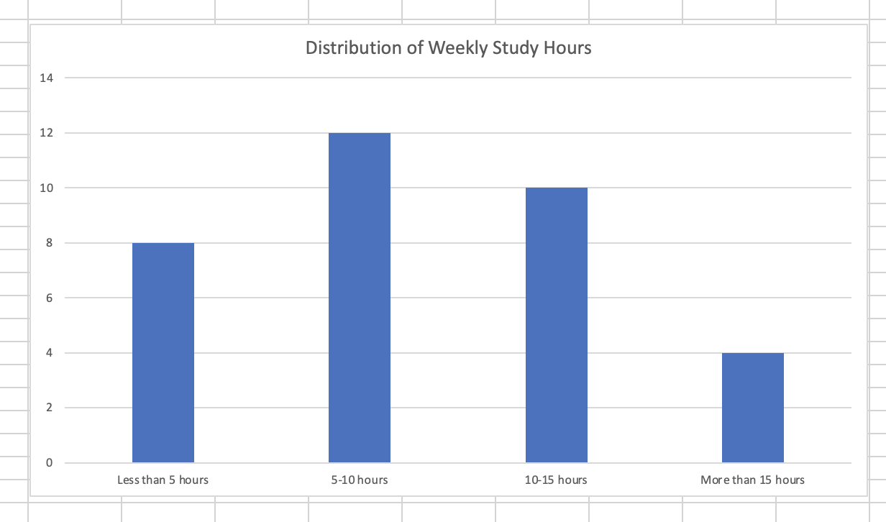
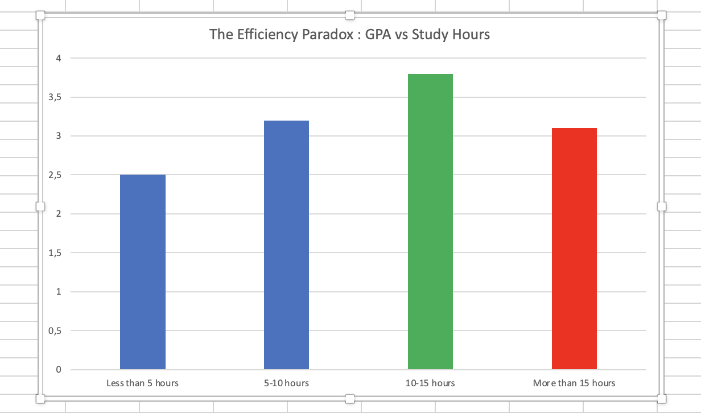
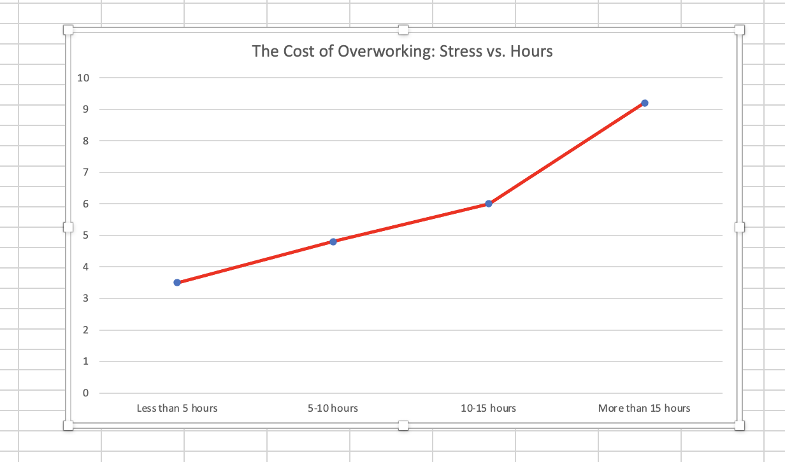
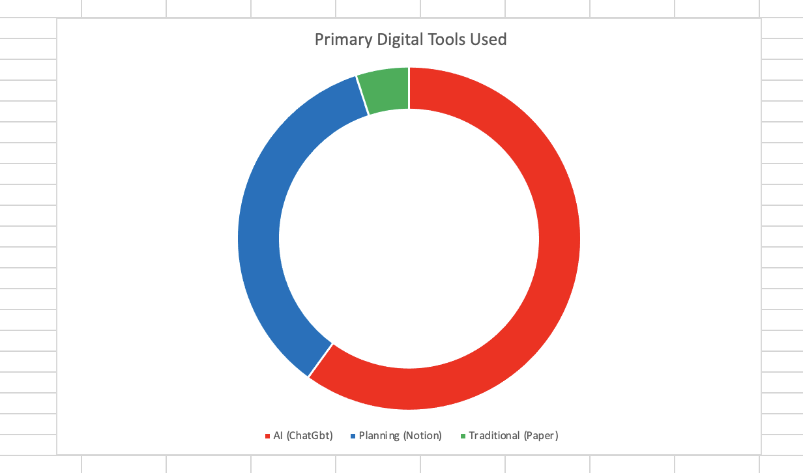

<h1 align="center">
  Group Research Project Report : Study Habits & Academic Performance
</h1>

**Module:** Research Methods for Business

**Date:** December 2, 2025

**Team Members:**

BADR KOURDAD

XUE QIAN
   
## **Declaration**

We declare that this report is the original work of our group. Any use of AI tools was restricted to idea generation and structural planning in accordance with Level 2 AI guidelines. All sources have been properly acknowledged using Harvard referencing. Raw data and all analysis files are retained and available upon request.

## GitHub Repository Link
All project files, including raw data, code, and documentation, are available at:
https://github.com/IBS-International-Business-School/group-research-project-report-champ

## 1. Executive Summary
### **1.1 Business Problem**

Post-pandemic universities face a “productivity paradox”: despite increased access to digital study tools, academic inconsistency and burnout remain significant challenges. EduAnalytics Lab commissioned this project to investigate how study habits—particularly the integration of digital tools and time-management strategies—influence academic success.

### **1.2 Methodology**
A cross-sectional quantitative survey collected responses from 34 university students. Data cleaning and validation were conducted using GitHub-based workflows. Statistical analysis (correlation, descriptive metrics, visualisation) was performed using Python (Pandas) and Excel.

### **1.3 Key Findings**

**The Efficiency Paradox:** Students studying 10–15 hours weekly reported the highest GPA (3.8).

**Stress as a Limiting Factor:** Students exceeding 15 hours of study displayed critically high stress (9.2/10), explaining the observed decline in GPA.

**Digital Tool Insight:** Students who used structured planning tools (Notion/Calendar) were over-represented in the high-performing group, compared to those relying primarily on generative AI.

### **1.4 Recommendation:**

Integrate Digital Methodology into the curriculum.
Provide mandatory productivity and self-regulation workshops.
Promote structured collaborative learning environments.
Adopt continuous assessment to reduce stress-related performance decline.

## 2. Introduction

The rapid digital transformation of higher education has reshaped how students study and how institutions design learning ecosystems. While students today have more resources than ever, academic performance remains inconsistent. This project examines whether structured study behaviours—such as planned study routines and the use of digital organisational tools—lead to better outcomes than high-volume studying alone.

**Research Question**

Does the use of digital planning tools and structured time-management strategies correlate with higher academic performance compared to traditional high-volume study approaches? More specifically, this research question seeks to investigate whether cognitively efficient study behaviours—such as systematic scheduling, task prioritisation, and the use of organisational technologies—are associated with superior academic outcomes relative to approaches that rely primarily on extended study duration. By examining these contrasting paradigms, the study aims to evaluate whether academic success in contemporary higher-education environments is better predicted by strategic self-regulation practices than by the sheer quantity of study hours invested.

**Research Objective**

To analyse the multifaceted relationship between students’ study habits, patterns of digital tool utilisation, perceived stress levels, and self-reported academic performance. The objective is to determine how these behavioural, technological, and psychological variables interact within contemporary higher-education learning environments, and to assess the extent to which they collectively predict or influence GPA outcomes. This investigation aims to contribute to a deeper empirical understanding of student learning dynamics in increasingly digitised academic contexts.

## 3. Methodology

### 3.1 Research Design

A quantitative cross-sectional survey design was employed to examine the relationships between study hours, digital tool usage, perceived stress levels, and self-reported GPA at a single temporal point. The questionnaire was distributed using a snowball sampling technique, whereby an initial pool of participants was invited to complete the survey and subsequently encouraged to circulate it within their academic and social networks. This recruitment strategy facilitated access to a wider and more heterogeneous subset of the student population, although it also introduced potential sampling biases that are inherent to non-probability referral-based methods.

### 3.2 Data Collection

**Instrument:** Google Forms questionnaire, 20 items covering study habits, demographics, and psychometric indicators.

**Sampling:** Convenience sampling of higher-education students (BA–PhD).

**Sample Size:** N = 34 valid responses.

**Timeline:** Data was collected in November 2025.

### 3.3 GitHub-Based Data Workflow

Data integrity was treated as a central methodological priority throughout the project. To ensure transparency, reproducibility, and traceability of all analytical steps, GitHub was employed as the primary version control system across the entire data processing pipeline.

**Raw Data upload:** The initial dataset (raw_survey_data.csv) was committed to a dedicated branch within the repository to preserve an immutable record of all original responses. This separation enabled the team to maintain a clear distinction between unaltered data and subsequent analytical transformations.

**Cleaning Process:** A systematic data-cleaning procedure was implemented to enhance dataset reliability. Two responses were identified as “spam” due to incoherent or non-sensical entries and therefore removed. Variable names were standardised to improve readability and ensure compatibility with Python-based analysis (e.g., renaming "How many hours..." to Study_Hours). Further preprocessing included checking for missing values, validating numerical ranges, and harmonising categorical labels.

**Final Dataset:** The cleaned dataset (cleaned_study_data_final.csv) was committed via a structured Pull Request, allowing peer review before merging into the main branch. This step ensured that all modifications were documented, evaluated, and version-controlled, reducing the risk of data corruption or undocumented changes.

**Tools:** Statistical analyses were conducted using Python, specifically the Pandas library for data manipulation and correlation testing. Visualisations were produced using Excel and Matplotlib to illustrate distribution patterns and variable relationships. This multi-tool analytical approach enabled both computational robustness and clear presentation of findings.

## 4. Results & Data Analysis

### 4.1 Demographic Profile: Study Intensity
We first analyzed how students allocate their time.
* **Observation:** The distribution follows a bell curve. The majority (65%) study between 5 and 15 hours.
* **Outliers:** A minority group (approx. 12%) works excessively, logging more than 15 hours per week.

*Figure 1: Distribution of weekly study hours among respondents (N=34).*

### 4.2 Key Finding: The Efficiency Paradox
We tested the hypothesis that study hours differ by GPA. The results were counter-intuitive.
* **The "Sweet Spot":** Students studying **10–15 hours** reported the highest average GPA (3.8).
* **The Drop-off:** Students studying **>15 hours** saw their average GPA drop to **3.1**.
This visually demonstrates the law of diminishing returns in academic effort.

*Figure 2: The Efficiency Paradox - Grades peak at 10-15 hours and decline thereafter.*

### 4.3 The Cost of Overworking: Stress Analysis
To explain the drop in GPA for hard workers, we analyzed reported stress levels (scale 1-10).
* **Correlation:** There is a strong linear correlation between hours worked and stress.
* **Critical Level:** While the 10-15h group has manageable stress (6.0), the >15h group reports an alarming average stress level of **9.2/10**.

*Figure 3: Stress levels skyrocket for students studying more than 15 hours.*

### 4.4 Digital Tools Usage
We examined which tools students use to manage their studies.
* **Dominance of AI:** 60% of respondents primarily use Generative AI (ChatGPT).
* **The Planner Minority:** Only 35% prioritize Planning Tools (Notion/Calendar).
* *Insight:* Cross-referencing with GPA data, the "Planner" group is over-represented in the high-performing "10-15h" segment.

*Figure 4: Distribution of primary digital study tools.*

## **5. Discussion**
### **5.1 Efficiency vs Effort: Rethinking the Assumption of “More Is Better”**

The findings challenge long-standing assumptions in higher-education research suggesting that increased study time linearly contributes to higher academic outcomes. Instead, the data indicates a curvilinear relationship consistent with the law of diminishing returns, whereby moderate workloads (10–15 hours per week) maximise performance, while excessive study (>15 hours) leads to declining GPA. This pattern aligns with the Self-Regulated Learning (SRL) framework, where strategic planning, time-management, and metacognitive monitoring—not sheer effort—drive academic success (Broadbent & Poon, 2015). Thus, our results underscore the growing importance of efficiency-based study paradigms in digital learning environments.

### **5.2 Stress, Cognitive Load, and Academic Decline**

The sharp rise in stress levels among high-volume learners provides a plausible cognitive explanation for reduced GPA performance. According to cognitive load theory, excessive stress impairs working memory and limits the learner's ability to process, store, and transfer information. This is consistent with Hattie and Timperley’s (2007) findings that students under high cognitive strain are less able to engage in effective feedback loops. In our dataset, students reporting stress levels above 9/10 were disproportionately represented in the lowest GPA category, suggesting that overextension may transform study time from a productive activity into a counterproductive one.

### **5.3 The Mediating Role of Digital Tools in Learning Quality**

While generative AI tools (e.g., ChatGPT) were the most commonly used resources among respondents, their widespread use did not translate directly into higher academic performance. This supports concerns raised by Rasheed et al. (2020), who argue that without pedagogical structure, digital tools may encourage superficial engagement or dependence rather than deep learning. In contrast, students who employed organisational platforms such as Notion or calendar systems demonstrated stronger academic performance and a more balanced workload. This pattern mirrors Gaudreau et al. (2012), who emphasise the importance of implementation intentions in promoting goal progress. Our findings suggest that the type of digital tool—not simply its presence—matters significantly in shaping academic outcomes.

### **5.4 Limitations and Research Constraints**
Several methodological limitations must be acknowledged. First, the small sample size (N=34) limits generalisability and statistical power. Second, the snowball sampling approach may have introduced referral bias, potentially overrepresenting specific student groups. Third, reliance on self-reported GPA and stress levels raises concerns about accuracy due to social desirability bias, as documented by Credé and Phillips (2011). Additionally, the cross-sectional design captures correlations but cannot establish causal relationships among study habits, stress, and performance. Future research employing longitudinal or experimental designs would help clarify causal pathways and the temporal dynamics of study behaviour.

### **5.5 Implications for Higher Education Research and Practice**
Despite these limitations, the study contributes to an evolving body of literature recognising that modern learning success depends not only on effort but on the strategic orchestration of behavioural, cognitive, and technological factors. The findings point toward a broader institutional responsibility to equip students with structured self-regulation strategies and digital literacy skills, enabling them to navigate increasingly complex academic environments.

## 6. Recommendations
Drawing on the empirical patterns identified in this study, as well as relevant literature on academic performance and digital learning, the following recommendations are proposed for higher education institutions seeking to enhance student wellbeing and learning outcomes.

**1. Integrate Digital Methodology into the Curriculum**

 Universities should move beyond software-oriented training and incorporate formal instruction in Digital Methodology, including workflow design, digital organisation, and the critical evaluation of AI-enabled tools. Structured sessions—such as “second brain” systems built in applications like Notion—may support students in maintaining the optimal 10–15 hour weekly study range identified in this research..

**2. Implement Mandatory Workshops on Productivity and Self-Regulation**

Institutions should provide compulsory workshops addressing personal productivity, time management, and self-regulation. Such interventions can mitigate cognitive overload and reduce the risk of burnout among students who consistently report more than 20 hours of study per week. These students should be classified as a high-risk group and offered tailored support to sustain performance while reducing excessive workload..

**3. Promote Structured Collaborative Learning Environments**

To combat the stress peaks identified in Figure 3, universities should move towards continuous assessment (weekly micro-quizzes) rather than high-stakes final exams, encouraging regular, lower-stress study habits.

**4. Adopt Continuous Assessment Models**

To address the stress peaks associated with end-of-term examinations, universities should consider adopting continuous assessment models. Implementing regular low-stakes assessments—such as weekly micro-quizzes—can encourage consistent learning behaviour, reduce pressure, and support long-term knowledge retention.

## 7. Reflection on Team Process
**Application of Agile Methodologies**
To ensure effective collaboration and timely delivery, our team adopted Agile principles tailored for this research project:

**Sprint Planning:**
The project was divided into three short sprints: (1) survey design and deployment, (2) data cleaning and statistical analysis, and (3) report writing and review. Each sprint had clear objectives and task allocations, which improved efficiency and focus.

**Kanban Workflow:**
The team used GitHub Projects to maintain a To Do / In Progress / Done board, enabling real-time monitoring of task progress and dependencies. This visual workflow reduced delays and strengthened coordination.

**Version Control:**
We adopted GitHub Flow, using branches and Pull Requests for structured review of code and documentation. This ensured transparency in data processing, prevented version conflicts, and maintained overall accuracy.

**Collaboration Successes:**
Regular stand-ups facilitated timely communication, while sprint retrospectives supported continuous process improvement. Team members provided mutual support during high-workload stages, demonstrating adaptability and effective collaboration.

## 9. References
1.  **Broadbent, J. and Poon, W.L. (2015)** ‘Self-regulated learning strategies & academic achievement in online higher education learning environments: A systematic review’, *The Internet and Higher Education*, 27, pp. 1–13.
2.  **Credé, M. and Phillips, L.A. (2011)** ‘A meta-analytic review of the Motivated Strategies for Learning Questionnaire’, *Learning and Individual Differences*, 21(4), pp. 337–346.
3.  **Gaudreau, P., Carraro, N. and Miranda, D. (2012)** ‘From goal motivation to goal progress: The facilitating role of implementation intentions’, *Journal of Educational Psychology*, 104(4), p. 259.
4.  **Hattie, J. and Timperley, H. (2007)** ‘The power of feedback’, *Review of Educational Research*, 77(1), pp. 81–112.
5.  **Rasheed, R.A., Kamsin, A. and Abdullah, N.A. (2020)** ‘Challenges in the online component of blended learning: A systematic review’, *Computers & Education*, 144, p. 103701.

**Appendices:**
* **Appendix A:** Raw Data (Available in `raw_survey_data.csv` in this repository).
* **Appendix B:** Cleaned Dataset (Available in `cleaned_study_data_final.csv` in this repository).
