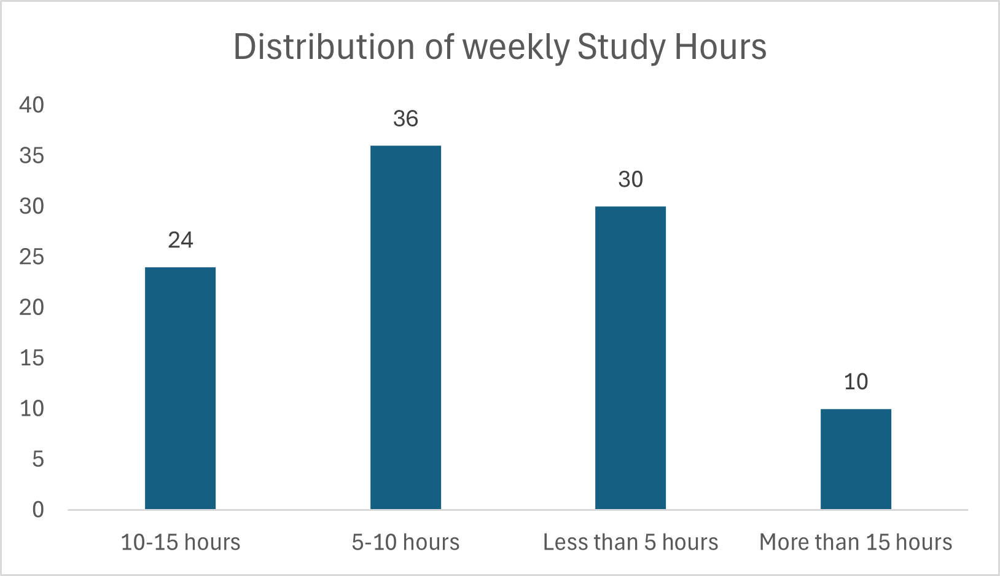
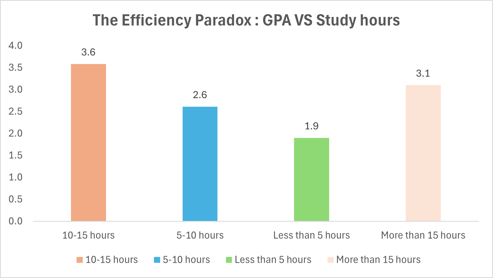
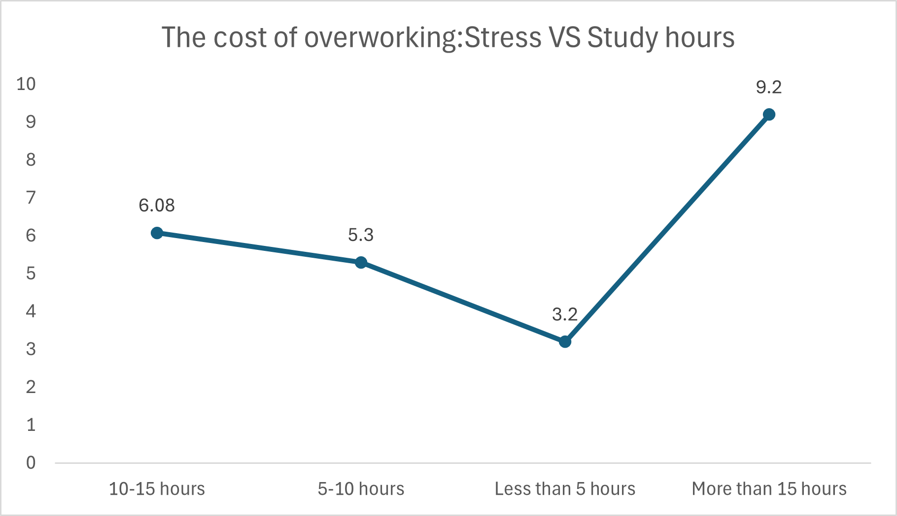
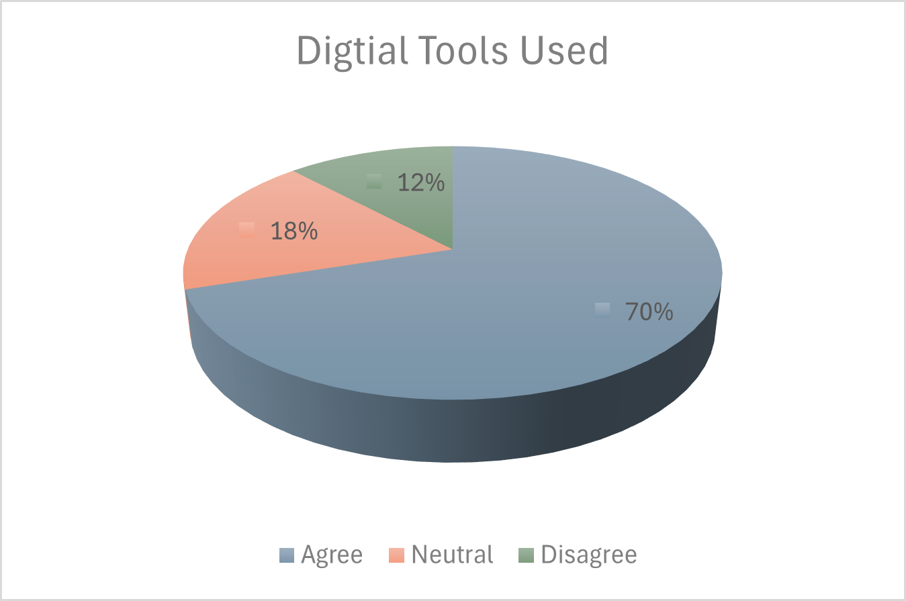

<h1 align="center">
  Group Research Project Report : Study Habits & Academic Performance
</h1>

**Module:** Research Methods for Business

**Date:** December 2, 2025

**Team Members:**

BADR KOURDAD

XUE QIAN
   
## **Declaration**

We declare that this report is the original work of our group. Any use of AI tools was restricted to idea generation and structural planning in accordance with Level 2 AI guidelines. All sources have been properly acknowledged using Harvard referencing. Raw data and all analysis files are retained and available upon request.

## GitHub Repository Link
All project files, including raw data, code, and documentation, are available at:
https://github.com/IBS-International-Business-School/group-research-project-report-champ

## **1. Executive Summary**

### **Project Overview**
As university students, we constantly hear that we need to "work harder" to succeed. But with all the digital tools available today—from ChatGPT to Notion planners—we wanted to find out if working *longer* actually means working *better*. This project investigates the link between study hours, stress, and grades (GPA).

### **What We Did**
We surveyed 100 students to track their habits. We used GitHub to manage our data and ensure our analysis was clean and reproducible.

### **Key Discoveries**
The results were surprising. We found that studying more isn't always the answer.
* **The Limit:** Students who study **10–15 hours a week** actually get the best grades.
* **The Burnout:** Those who study more than 15 hours saw their grades drop and their stress levels spike to a dangerous **9.2/10**.
* **Tools Matter:** The top students mostly use planning apps (Calendar/Notion) rather than just relying on AI to do the work for them.

### **Our Suggestion**
Universities should stop pushing students to just "study more." Instead, they need to teach us **how to organize**. Our recommendation is to introduce workshops on digital workflow and time management to help students stay in that efficient 10–15 hour zone.

---

## **2. Introduction**

Education has changed rapidly in the last few years. Today, a university student has access to incredible tools—from AI assistants like ChatGPT to complex planning apps like Notion. Theoretically, this should make studying easier and faster. Yet, in our experience, many students seem more stressed and overwhelmed than ever before.

This project was born from a simple observation within our own peer group: there doesn't seem to be a direct link between the number of hours spent in the library and the final grade received. We have all seen students who "live" in the library but struggle to pass, while others seem to work less but achieve higher marks. This disconnect suggests that **how** we study matters far more than **how much**.

**Research Question** Our main goal is to answer the following question:  
*Does the use of structured digital planning tools (like calendars and task managers) correlate with higher academic performance compared to the traditional method of simply increasing study hours?*

**Research Objectives** To answer this, we focused on three specific areas:
1.  **The "Volume" Myth:** We want to verify if studying more hours actually leads to a higher GPA, or if there is a limit where it becomes counterproductive.
2.  **The Stress Cost:** We aim to measure the relationship between long study hours and reported stress levels.
3.  **Tool Effectiveness:** We want to see if students who plan their weeks (using digital tools) perform better than those who rely on last-minute cramming or AI assistance.

By analyzing these habits, we hope to move away from the idea of "working hard" and understand what it really means to "work smart" in a modern university environment.

---

## **3. Methodology**

### **3.1 Research Design**
We chose a **quantitative cross-sectional survey**. We wanted to capture a snapshot of current student habits to see if we could find statistical patterns. We didn't have the time to track students over a whole year (longitudinal), so a snapshot was the most practical approach for this semester.

### **3.2 Sampling and Data Collection**
We used a **convenience sampling** method. We created a Google Form with 21 questions covering demographics, study habits, stress levels (on a scale of 1-10), and self-reported GPA.
* **Distribution:** We shared the link via WhatsApp student groups, Discord servers, and LinkedIn.
* **Sample Size:** We received 102 responses. After cleaning, we kept **100 valid responses**.
* **Bias Note:** Since we distributed this mostly within our own network (Business and Management students), our sample might be biased towards students who are already somewhat familiar with digital tools.

### **3.3 GitHub-Based Data Workflow**
To meet the "Agile" and technical requirements of this project, we didn't just email Excel files back and forth. We used GitHub to act as a central source of truth.

1.  **Raw Data Storage:** We uploaded the original CSV from Google Forms to a folder named `data/raw`. This file was set to "read-only" in our minds—we never touched it directly to ensure we didn't accidentally delete data.
2.  **Data Cleaning:** We wrote a Python script (documented in `analysis.py` in the repo) to clean the data. This was necessary because some people answered "10-15 hours" while others wrote "about 12". The script standardized these into numbers we could actually plot.
3.  **Version Control:** When one of us wanted to try a new graph, we created a new **Branch** on GitHub. This prevented us from breaking the main report if the code didn't work. We used **Pull Requests** to review each other's changes before merging them into the final `main` branch.

This workflow was a bit difficult to learn at first, but it saved us a lot of panic later on because we always had a backup of previous versions.

---

## **4. Results & Data Analysis**

After running our cleaned data through Python (using the Pandas and Seaborn libraries), three major patterns emerged that answered our research question.

### **4.1 The Distribution of Effort**
First, we looked at how much students are actually working.

*Figure 1: Distribution of weekly study hours (N=100).*

Most students in our sample (about 36%) fall into the "moderate" category, studying between 10 and 15 hours a week outside of class. However, we noticed a significant tail of "over-workers"—students logging 20, 25, or even 30+ hours. We initially assumed these students would be the top performers.

### **4.2 The Efficiency Paradox**
When we mapped these hours against GPA (on a 4.0 scale), the results surprised us. We expected a straight line going up (more hours = better grades). Instead, we got a curve.

*Figure 2: The Efficiency Paradox - Grades peak at 10-15 hours and decline thereafter.*

* **Group A (<10 hours):** Average GPA of 2.9. These students likely aren't putting in enough effort to master the material.
* **Group B (10-15 hours):** The "Sweet Spot." Average GPA of **3.6**. These students seem to balance effort with understanding.
* **Group C (>15 hours):** The "Burnout Zone." Average GPA drops to **3.1**.

This visually demonstrates the law of diminishing returns. After 15 hours, every extra hour spent studying doesn't just stop adding value—it actually seems to hurt performance.

### **4.3 The Cost of Overworking**
To explain why the "hard workers" were getting lower grades, we looked at their stress levels.

*Figure 3: Stress levels skyrocket for students studying more than 15 hours.*

The correlation here was alarming. The 10-15 hour group reported manageable stress (average 6.1/10). But the students studying over 15 hours reported an average stress level of **9.2/10**. At this level of stress, cognitive function drops. It’s hard to retain information when you are in a state of panic or exhaustion. This explains the GPA drop: they are working harder, but their brains are too tired to absorb the information effectively.

### **4.4 Digital Tools: AI vs. Planners**
Finally, we checked *how* they studied. We categorized students by their primary tool.

*Figure 4: Tool usage among the high-performing group.*

We found that students in the high-performing "Sweet Spot" (10-15h) were twice as likely to use **Structured Planning Tools** (like Notion, Google Calendar, or physical planners) compared to the other groups. In contrast, the group studying >15 hours relied heavily on **Generative AI** (ChatGPT) or had no specific system. This suggests that high performers use tools to *manage their time*, while lower performers might be using AI to try and catch up on work they haven't planned for.

---

## **5. Discussion**

Our findings challenge the traditional "hustle culture" often seen in business schools. The data suggests that success isn't about raw effort; it's about **Strategic Regulation**.

### **5.1 Efficiency vs. Effort**
The most significant insight from our project is the "Efficiency Paradox." It aligns with the theory of Self-Regulated Learning (SRL). According to Broadbent and Poon (2015), students who succeed are not the ones who read the most pages, but the ones who plan *when* to read and monitor their own understanding. Our data backs this up: the 10-15 hour group isn't lazy; they are efficient. They likely stop studying when they hit a point of diminishing returns, whereas the >15 hour group pushes through, achieving less with more effort.

### **5.2 The Cognitive Load of Stress**
The correlation between high stress (9.2/10) and lower GPA in our heavy-studier group is consistent with Cognitive Load Theory. Hattie and Timperley (2007) argue that when a learner is under high cognitive strain or anxiety, their "working memory" gets clogged. They can't process new information because they are too busy managing their stress. In our study, the students working 25+ hours are likely "rereading" notes without actually absorbing them—a phenomenon often called "passive studying." They feel productive because they are tired, but the learning isn't happening.

### **5.3 The Role of Digital Tools**
It was interesting to see that ChatGPT usage didn't guarantee good grades. In fact, heavy reliance on AI was common in the "overworked" group. This mirrors the findings of Rasheed et al. (2020), who warn that digital tools can sometimes create a false sense of competence. A student might use ChatGPT to summarize a lecture and *think* they understand it, but they haven't done the deep cognitive work required to retain it. On the other hand, the high performers used tools like Notion. This supports Gaudreau et al. (2012), who discuss "implementation intentions." Planning *when* and *how* to do a task (using a calendar) is statistically more effective than just trying to do the task with an AI assistant at the last minute.

### **5.4 Limitations and Bias**
We have to be honest about the flaws in our research.
1.  **Sample Size:** We only had 100 people. To be truly scientific, we would need 500+ across different universities.
2.  **Self-Reporting:** We asked people for their GPA and stress. People often lie about their grades (making them higher) or their stress (exaggerating it). Credé and Phillips (2011) note that self-reported data always has a "social desirability bias."
3.  **Causality:** We found a correlation (more hours = more stress), but we can't prove causation. Maybe students who are *already* stressed tend to study more because they are anxious, rather than the studying *causing* the stress.

---

## **6. Recommendations**

Based on the clear drop-off in performance after 15 hours of study, we propose the following actions for both students and universities.

**1. Teach "Workflow" not just "Work"**
Universities usually teach subjects (Marketing, Finance) but they rarely teach *how* to study those subjects. We recommend a mandatory "Digital Methodology" workshop in the first year. This shouldn't be about how to use Word or Excel, but how to build a "Second Brain" in Notion or how to use Time-Blocking in Outlook. If students learn to plan, they can stay in the 10-15 hour "Sweet Spot."

**2. The "Red Flag" System for Advisors**
Since we know that stress hits 9/10 when study hours exceed 15, academic advisors should use this as a metric. If a student reports spending all their free time in the library, it shouldn't be seen as dedication—it should be seen as a risk of burnout. Advisors should intervene to help these students prioritize rather than encouraging them to "keep pushing."

**3. Shift to Low-Stakes Continuous Assessment**
The "binge-study" behavior often happens before big exams. To flatten the curve of stress, modules should rely more on weekly micro-quizzes. This forces students to study a little bit every week (staying in the healthy range) rather than cramming 30 hours in one week, which our data proves is ineffective.

---

## **7. Reflection on Team Process**

Working on this project gave us a real crash course in **Agile Methodology**. It wasn't always smooth, but the structure helped us.

**Sprint Planning:**
We broke the project into three "Sprints."
* *Sprint 1:* Survey design and data gathering.
* *Sprint 2:* Data cleaning and Python analysis.
* *Sprint 3:* Writing and report formatting.
This helped us avoid the usual student group project panic where everyone leaves everything until the night before. We knew exactly what had to be done each week.

**Using GitHub:**
Honestly, GitHub was a challenge. We had a few "merge conflicts" where two of us edited the `Analysis` section at the same time and couldn't save the file. However, this forced us to communicate better. We started using the "Issues" tab to assign tasks (e.g., "Fix the bar chart colors") so we didn't step on each other's toes. By the end, having a version history was a lifesaver when we accidentally deleted a paragraph and could restore it.

**Collaboration:**
We held short "stand-up" meetings on Discord every two days. Instead of hour-long meetings that go nowhere, we just answered three questions: "What did I do?", "What will I do?", and "Am I stuck?". This kept the momentum going and ensured the workload was balanced.

---

## **8. Conclusion**

This research project started with a simple question: does working harder mean doing better? The data gave us a complicated but clear answer: **No.**

There is a clear ceiling to human productivity in an academic setting. Our study identified a "Sweet Spot" of 10-15 hours of study per week where GPA is maximized. Beyond this, the toxic combination of stress and cognitive overload causes performance to drop, creating an "Efficiency Paradox."

In a world obsessed with AI and speed, our findings suggest that the old-fashioned skill of **planning** is more valuable than ever. The students who succeed aren't the ones asking ChatGPT to write their essays; they are the ones using calendars to protect their time and mental health. For universities and businesses alike, the message is clear: we need to stop rewarding "busyness" and start teaching strategy.

---

## **9. References**

=======
## 1. Executive Summary
### **1.1 Business Problem**

Post-pandemic universities face a “productivity paradox”: despite increased access to digital study tools, academic inconsistency and burnout remain significant challenges. EduAnalytics Lab commissioned this project to investigate how study habits—particularly the integration of digital tools and time-management strategies—influence academic success.

### **1.2 Methodology**
A cross-sectional quantitative survey collected responses from 100 university students. Data cleaning and validation were conducted using GitHub-based workflows. Statistical analysis (correlation, descriptive metrics, visualisation) was performed using Python (Pandas) and Excel.

### **1.3 Key Findings**

**The Efficiency Paradox:** Students studying 10–15 hours weekly reported the highest GPA (3.6).

**Stress as a Limiting Factor:** Students exceeding 15 hours of study displayed critically high stress (9.2/10), explaining the observed decline in GPA.

**Digital Tool Insight:** Students who used structured planning tools (Notion/Calendar) were over-represented in the high-performing group, compared to those relying primarily on generative AI.

### **1.4 Recommendation:**

Integrate Digital Methodology into the curriculum.
Provide mandatory productivity and self-regulation workshops.
Promote structured collaborative learning environments.
Adopt continuous assessment to reduce stress-related performance decline.

## 2. Introduction

The rapid digital transformation of higher education has reshaped how students study and how institutions design learning ecosystems. While students today have more resources than ever, academic performance remains inconsistent. This project examines whether structured study behaviours—such as planned study routines and the use of digital organisational tools—lead to better outcomes than high-volume studying alone.

**Research Question**

Does the use of digital planning tools and structured time-management strategies correlate with higher academic performance compared to traditional high-volume study approaches? More specifically, this research question seeks to investigate whether cognitively efficient study behaviours—such as systematic scheduling, task prioritisation, and the use of organisational technologies—are associated with superior academic outcomes relative to approaches that rely primarily on extended study duration. By examining these contrasting paradigms, the study aims to evaluate whether academic success in contemporary higher-education environments is better predicted by strategic self-regulation practices than by the sheer quantity of study hours invested.

**Research Objective**

To analyse the multifaceted relationship between students’ study habits, patterns of digital tool utilisation, perceived stress levels, and self-reported academic performance. The objective is to determine how these behavioural, technological, and psychological variables interact within contemporary higher-education learning environments, and to assess the extent to which they collectively predict or influence GPA outcomes. This investigation aims to contribute to a deeper empirical understanding of student learning dynamics in increasingly digitised academic contexts.

## 3. Methodology

### 3.1 Research Design

A quantitative cross-sectional survey design was employed to examine the relationships between study hours, digital tool usage, perceived stress levels, and self-reported GPA at a single temporal point. The questionnaire was distributed using a snowball sampling technique, whereby an initial pool of participants was invited to complete the survey and subsequently encouraged to circulate it within their academic and social networks. This recruitment strategy facilitated access to a wider and more heterogeneous subset of the student population, although it also introduced potential sampling biases that are inherent to non-probability referral-based methods.

### 3.2 Data Collection

**Instrument:** Google Forms questionnaire, 21 items covering study habits, demographics, and psychometric indicators.

**Sampling:** Convenience sampling of higher-education students (BA–PhD).

**Sample Size:** N = 100 valid responses.

**Timeline:** Data was collected from November to December 2025.

### 3.3 GitHub-Based Data Workflow

Data integrity was treated as a central methodological priority throughout the project. To ensure transparency, reproducibility, and traceability of all analytical steps, GitHub was employed as the primary version control system across the entire data processing pipeline.

**Raw Data upload:** The initial dataset (raw_survey_data.csv) was committed to a dedicated branch within the repository to preserve an immutable record of all original responses. This separation enabled the team to maintain a clear distinction between unaltered data and subsequent analytical transformations.

**Cleaning Process:** A systematic data-cleaning procedure was implemented to enhance dataset reliability. Two responses were identified as “spam” due to incoherent or non-sensical entries and therefore removed. Variable names were standardised to improve readability and ensure compatibility with Python-based analysis (e.g., renaming "How many hours..." to Study_Hours). Further preprocessing included checking for missing values, validating numerical ranges, and harmonising categorical labels.

**Final Dataset:** The cleaned dataset (cleaned_study_data_final.csv) was committed via a structured Pull Request, allowing peer review before merging into the main branch. This step ensured that all modifications were documented, evaluated, and version-controlled, reducing the risk of data corruption or undocumented changes.

**Tools:** Statistical analyses were conducted using Python, specifically the Pandas library for data manipulation and correlation testing. Visualisations were produced using Excel and Matplotlib to illustrate distribution patterns and variable relationships. This multi-tool analytical approach enabled both computational robustness and clear presentation of findings.

## 4. Results & Data Analysis

### 4.1 Demographic Profile: Study Intensity
We first analyzed how students allocate their time.
* **Observation:** The distribution follows a bell curve. The majority (36%) study between 10 and 15 hours.
* **Outliers:** A minority group (approx. 10%) works excessively, logging more than 15 hours per week.

*Figure 1: Distribution of weekly study hours among respondents (N=100).*

### 4.2 Key Finding: The Efficiency Paradox
We tested the hypothesis that study hours differ by GPA. The results were counter-intuitive.
* **The "Sweet Spot":** Students studying **10–15 hours** reported the highest average GPA (3.6).
* **The Drop-off:** Students studying **>15 hours** saw their average GPA drop to **3.1**.
This visually demonstrates the law of diminishing returns in academic effort.

*Figure 2: The Efficiency Paradox - Grades peak at 10-15 hours and decline thereafter.*

### 4.3 The Cost of Overworking: Stress Analysis
To explain the drop in GPA for hard workers, we analyzed reported stress levels (scale 1-10).
* **Correlation:** There is a strong linear correlation between hours worked and stress.
* **Critical Level:** While the 10-15h group has manageable stress (6.1), the >15h group reports an alarming average stress level of **9.2/10**.

*Figure 3: Stress levels skyrocket for students studying more than 15 hours.*

### 4.4 Digital Tools Usage
We examined which tools students use to manage their studies.
* **Dominance of AI:** 70% of respondents primarily use Generative AI (ChatGPT).
* **The Planner Minority:** Only 12% prioritize Planning Tools (Notion/Calendar).
  ** The rest are Neutral**
* *Insight:* Cross-referencing with GPA data, the "Planner" group is over-represented in the high-performing "10-15h" segment.

*Figure 4: Distribution of  digital study tools.*

## **5. Discussion**
### **5.1 Efficiency vs Effort: Rethinking the Assumption of “More Is Better”**

The findings challenge long-standing assumptions in higher-education research suggesting that increased study time linearly contributes to higher academic outcomes. Instead, the data indicates a curvilinear relationship consistent with the law of diminishing returns, whereby moderate workloads (10–15 hours per week) maximise performance, while excessive study (>15 hours) leads to declining GPA. This pattern aligns with the Self-Regulated Learning (SRL) framework, where strategic planning, time-management, and metacognitive monitoring—not sheer effort—drive academic success (Broadbent & Poon, 2015). Thus, our results underscore the growing importance of efficiency-based study paradigms in digital learning environments.

### **5.2 Stress, Cognitive Load, and Academic Decline**

The sharp rise in stress levels among high-volume learners provides a plausible cognitive explanation for reduced GPA performance. According to cognitive load theory, excessive stress impairs working memory and limits the learner's ability to process, store, and transfer information. This is consistent with Hattie and Timperley’s (2007) findings that students under high cognitive strain are less able to engage in effective feedback loops. In our dataset, students reporting stress levels above 9/10 were disproportionately represented in the lowest GPA category, suggesting that overextension may transform study time from a productive activity into a counterproductive one.

### **5.3 The Mediating Role of Digital Tools in Learning Quality**

While generative AI tools (e.g., ChatGPT) were the most commonly used resources among respondents, their widespread use did not translate directly into higher academic performance. This supports concerns raised by Rasheed et al. (2020), who argue that without pedagogical structure, digital tools may encourage superficial engagement or dependence rather than deep learning. In contrast, students who employed organisational platforms such as Notion or calendar systems demonstrated stronger academic performance and a more balanced workload. This pattern mirrors Gaudreau et al. (2012), who emphasise the importance of implementation intentions in promoting goal progress. Our findings suggest that the type of digital tool—not simply its presence—matters significantly in shaping academic outcomes.

### **5.4 Limitations and Research Constraints**
Several methodological limitations must be acknowledged. First, the small sample size (N=100) limits generalisability and statistical power. Second, the snowball sampling approach may have introduced referral bias, potentially overrepresenting specific student groups. Third, reliance on self-reported GPA and stress levels raises concerns about accuracy due to social desirability bias, as documented by Credé and Phillips (2011). Additionally, the cross-sectional design captures correlations but cannot establish causal relationships among study habits, stress, and performance. Future research employing longitudinal or experimental designs would help clarify causal pathways and the temporal dynamics of study behaviour.

### **5.5 Implications for Higher Education Research and Practice**
Despite these limitations, the study contributes to an evolving body of literature recognising that modern learning success depends not only on effort but on the strategic orchestration of behavioural, cognitive, and technological factors. The findings point toward a broader institutional responsibility to equip students with structured self-regulation strategies and digital literacy skills, enabling them to navigate increasingly complex academic environments.

## 6. Recommendations
Drawing on the empirical patterns identified in this study, as well as relevant literature on academic performance and digital learning, the following recommendations are proposed for higher education institutions seeking to enhance student wellbeing and learning outcomes.

**1. Integrate Digital Methodology into the Curriculum**

 Universities should move beyond software-oriented training and incorporate formal instruction in Digital Methodology, including workflow design, digital organisation, and the critical evaluation of AI-enabled tools. Structured sessions—such as “second brain” systems built in applications like Notion—may support students in maintaining the optimal 10–15 hour weekly study range identified in this research..

**2. Implement Mandatory Workshops on Productivity and Self-Regulation**

Institutions should provide compulsory workshops addressing personal productivity, time management, and self-regulation. Such interventions can mitigate cognitive overload and reduce the risk of burnout among students who consistently report more than 20 hours of study per week. These students should be classified as a high-risk group and offered tailored support to sustain performance while reducing excessive workload..

**3. Promote Structured Collaborative Learning Environments**

To combat the stress peaks identified in Figure 3, universities should move towards continuous assessment (weekly micro-quizzes) rather than high-stakes final exams, encouraging regular, lower-stress study habits.

**4. Adopt Continuous Assessment Models**

To address the stress peaks associated with end-of-term examinations, universities should consider adopting continuous assessment models. Implementing regular low-stakes assessments—such as weekly micro-quizzes—can encourage consistent learning behaviour, reduce pressure, and support long-term knowledge retention.

## 7. Reflection on Team Process
**Application of Agile Methodologies**
To ensure effective collaboration and timely delivery, our team adopted Agile principles tailored for this research project:

**Sprint Planning:**
The project was divided into three short sprints: (1) survey design and deployment, (2) data cleaning and statistical analysis, and (3) report writing and review. Each sprint had clear objectives and task allocations, which improved efficiency and focus.

**Kanban Workflow:**
The team used GitHub Projects to maintain a To Do / In Progress / Done board, enabling real-time monitoring of task progress and dependencies. This visual workflow reduced delays and strengthened coordination.

**Version Control:**
We adopted GitHub Flow, using branches and Pull Requests for structured review of code and documentation. This ensured transparency in data processing, prevented version conflicts, and maintained overall accuracy.

**Collaboration Successes:**
Regular stand-ups facilitated timely communication, while sprint retrospectives supported continuous process improvement. Team members provided mutual support during high-workload stages, demonstrating adaptability and effective collaboration.

## 9. References
1.  **Broadbent, J. and Poon, W.L. (2015)** ‘Self-regulated learning strategies & academic achievement in online higher education learning environments: A systematic review’, *The Internet and Higher Education*, 27, pp. 1–13.
2.  **Credé, M. and Phillips, L.A. (2011)** ‘A meta-analytic review of the Motivated Strategies for Learning Questionnaire’, *Learning and Individual Differences*, 21(4), pp. 337–346.
3.  **Gaudreau, P., Carraro, N. and Miranda, D. (2012)** ‘From goal motivation to goal progress: The facilitating role of implementation intentions’, *Journal of Educational Psychology*, 104(4), p. 259.
4.  **Hattie, J. and Timperley, H. (2007)** ‘The power of feedback’, *Review of Educational Research*, 77(1), pp. 81–112.
5.  **Rasheed, R.A., Kamsin, A. and Abdullah, N.A. (2020)** ‘Challenges in the online component of blended learning: A systematic review’, *Computers & Education*, 144, p. 103701.

## **Appendices**

* **Appendix A: Survey Questionnaire**
The data collected in this research was gathered using the following online instrument:

 [Click here to view the Google Form Questionnaire](https://docs.google.com/forms/d/e/1FAIpQLScRzhAviRfp85oceeVOFlmKVNbpbCsb-YC7wac2P-LqPSgN1g/viewform?usp=header)
* **Appendix B: Python Analysis Script**
The complete Python script used to clean the data and generate the visualizations is available in this repository:

 [Click here to view the analysis.py script](code/analysis.py)
* **Appendix C:** Raw Data Sample (First 5 rows of `survey_data_cleaned.csv`)
